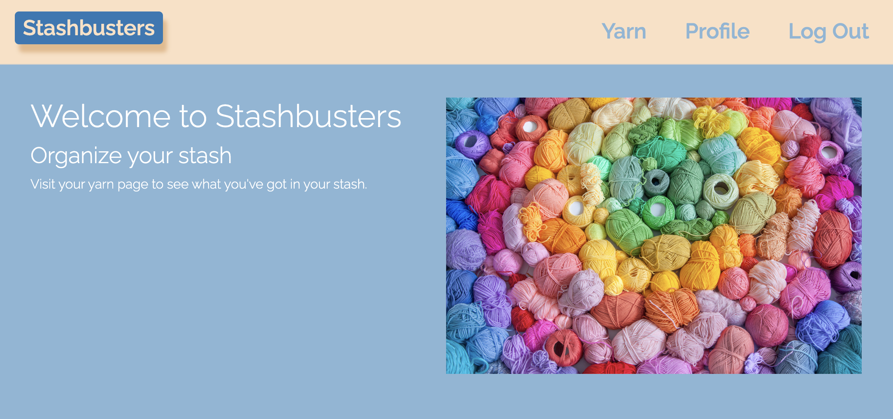
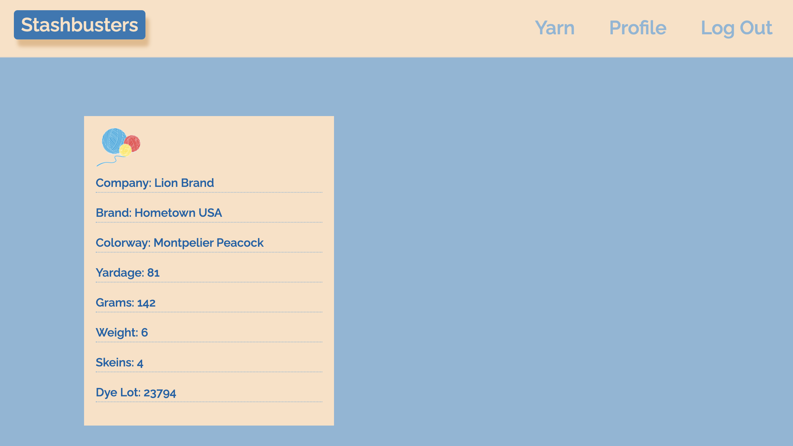

# stashbusters
This is our second project for University of Oregon coding bootcamp.

## About the project 
**Stashbusters**
A Pokédex of yarn. Stashbusters was design to help keep your yarn organized!

## User Story
* As a user, I able to create a profile using a username and password
* I can view my current stash of yarn
* I am able to add a new yarn and yarn details

## Built With
Yarn install is required to install dependencies
* Bcrypt
* Dotenv
* Express
* Express-handlebars
* Mysql2
* Sequelize

## Link to Project
https://github.com/calliebn/stashbusters.git

## Heroku Link
https://nameless-mesa-29731.herokuapp.com/

## Authors

Callie Nipper

Goldiluck Rebollido

KP 

Josseline Rendon
